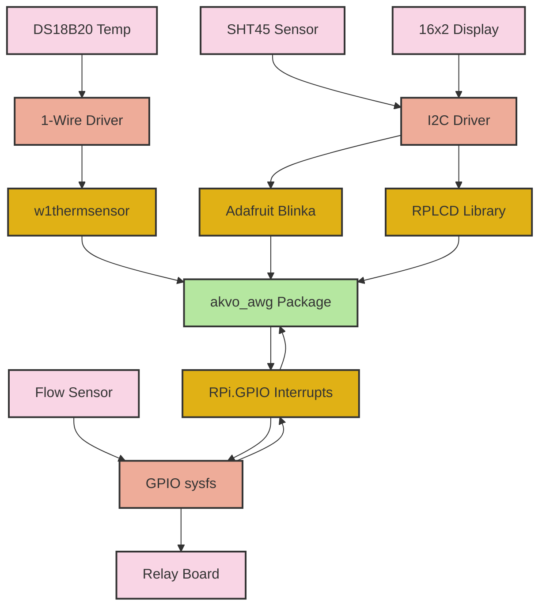
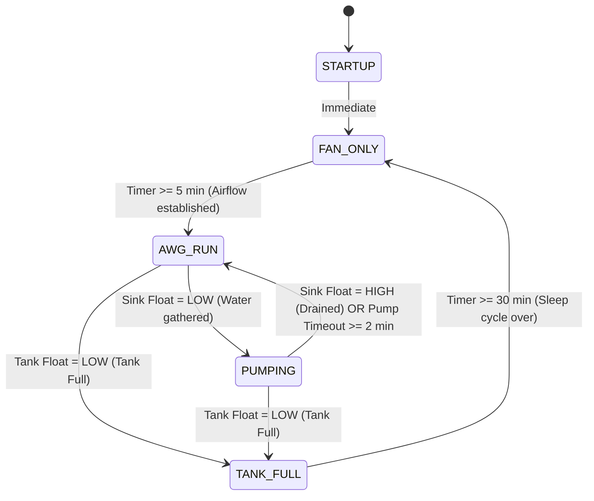

# 💧 AKVO AWG — Sensor Monitoring & Automation System

[](https://www.raspberrypi.com/)
[](https://www.python.org/)
[](https://systemd.io/)
[](https://akvosphere.com/)

An industrial-grade, highly reliable **Atmospheric Water Generator (AWG) Sensor Monitoring & Relay Automation System** designed for the **Raspberry Pi 3A** platform. Originally adapted from ESP32 firmware, this system uses a robust, non-blocking paged UI architecture to monitor physical sensors, track water volumes, and run a safe, timed finite state machine (FSM) to control condenser fans, compressors, and extraction pumps.

Developed by **Mithun Kumar J** for **Akvosphere**.

---

## 📂 System Documentation Index

We have established a dedicated `/readme` directory containing modular, comprehensive guides for each part of the system. Click the links below to explore the deep documentation:

* **🔌 [Hardware Wiring & Pin Mappings](file:///c:/Users/mith1/OneDrive/Desktop/AKVO/Rasp/readme/hardware_wiring.md)**: Physical pinouts, electrical pull-up guidelines, and electrical isolation practices.
* **🤖 [FSM State Machine & Relay Logic](file:///c:/Users/mith1/OneDrive/Desktop/AKVO/Rasp/readme/state_machine.md)**: Transition tables, truth maps, safety timers, and mode exit conditions.
* **🏗️ [Software Architecture & Execution Stack](file:///c:/Users/mith1/OneDrive/Desktop/AKVO/Rasp/readme/architecture.md)**: Monotonic scheduler design, module specifications, and thread-safe interrupts.
* **🚀 [Installation, Operation & Service Daemon](file:///c:/Users/mith1/OneDrive/Desktop/AKVO/Rasp/readme/installation_and_operation.md)**: Step-by-step setup, debugging scans, and systemd deployment.

---

## 🌟 Key Features

* **⏱️ Monotonic Time Orchestration**: The main program loop avoids CPU-blocking calls or NTP clock drift using Python's `time.monotonic()` clock. Everything operates on cooperative, elapsed timers.
* **🌀 5-Stage Safety State Machine**: Operates a secure cycle (**STARTUP ➔ FAN_ONLY ➔ AWG_RUN ➔ PUMPING ➔ TANK_FULL**) with built-in pump dry-run timeout safety limits and tank full sleep intervals.
* **💧 High-Precision Flow Calculation**: MR-L10-S flow sensor pulses are captured on hardware level through falling-edge interrupts. Edge handling is done inside a thread-safe, locked global accumulator block to avoid lost pulses.
* **🌡️ Multi-Sensor Integration**: Synchronously tracks ambient parameters (**SHT45** relative humidity and temperature over I2C) and copper pipe temperature (**DS18B20** via kernel 1-Wire) with automatic connection drop-out recovery.
* **📺 Flickless Paged UI LCD**: Drives a 16x2 I2C Character Display, rotating three customized pages every 3 seconds (Temp screen ➔ Humidity/Flow screen ➔ Total Water volume screen) with smart differential re-renders to prevent flickering.

---

## 🗺️ Software-Hardware Architecture



---

## 🤖 The Control State Machine

The FSM safeguards expensive generator components from damage while automating water harvesting and extraction:



---

## ⚡ Quick Start Guide (RPi Terminal)

For detailed step-by-step instructions, please consult the **[Installation and Operation Guide](file:///c:/Users/mith1/OneDrive/Desktop/AKVO/Rasp/readme/installation_and_operation.md)**. Here is the quick-reference cheat sheet for setting up the daemon:

### 1. Enable Hardware Buses
Open config:
```bash
sudo nano /boot/config.txt
```
Append:
```ini
dtparam=i2c_arm=on
dtoverlay=w1-gpio,gpiopin=4
```
Reboot:
```bash
sudo reboot
```

### 2. Install Packages & Run
```bash
sudo apt update && sudo apt install -y python3-pip python3-smbus i2c-tools
pip3 install -r requirements.txt --break-system-packages
sudo python3 -m akvo_awg.main
```

### 3. Setup Boot Service
Create unit file:
```bash
sudo nano /etc/systemd/system/akvo-awg.service
```
Paste:
```ini
[Unit]
Description=AKVO AWG Sensor Monitoring System
After=multi-user.target

[Service]
ExecStart=/usr/bin/python3 -m akvo_awg.main
WorkingDirectory=/home/pi
Restart=always
User=root

[Install]
WantedBy=multi-user.target
```
Enable and view logs:
```bash
sudo systemctl enable akvo-awg.service --now
sudo journalctl -u akvo-awg.service -f
```

---

## 🏢 About Akvosphere
Akvosphere manufactures world-class Atmospheric Water Generators designed to harvest pure, clean drinking water directly from the humidity in the air. This Raspberry Pi monitoring solution enables intelligent automation, real-time volume diagnostics, and reliable fail-safe states to keep Akvosphere generators operating optimally around the clock.
